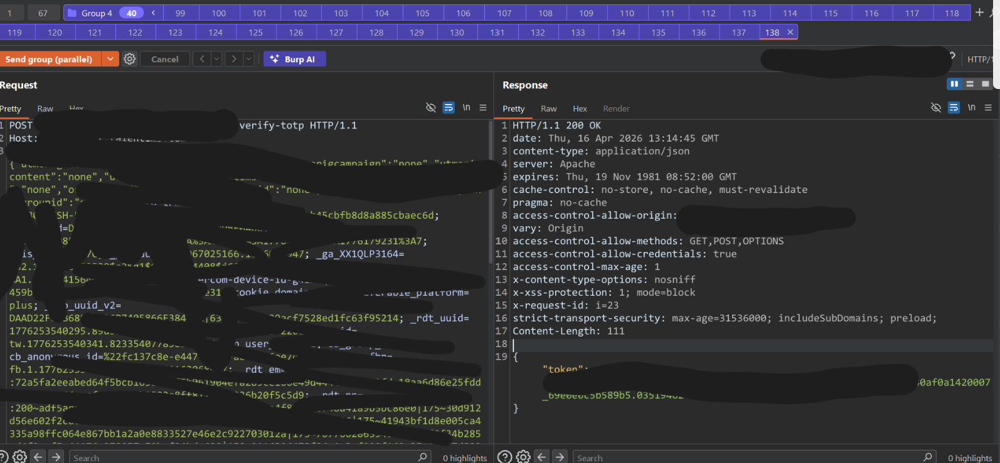
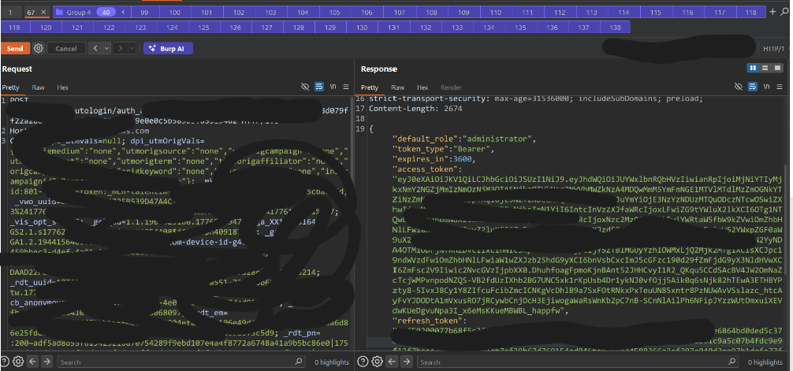

# بِسْمِ اللَّهِ الرَّحْمَنِ الرَّحِيمِ 
During my testing of a web application,

I was testing the 2FA function in the web app, so I tried multiple ways to bypass it, but all of them failed and the function seemed secure.

However, I became interested in how the application handled multiple verification attempts arriving at the same time.

To test this scenario, I intercepted the OTP verification request and moved it to Burp Suite Repeater.

## **Steps To Reproduce:**

1. Navigate to the login portal and enter valid credentials for a victim account to reach the 2FA prompt.
    
2. Intercept the 2FA submission request using Burp Suite.
    
3. Send the intercepted request to Burp Repeater.
    
4. Create a group of parallel requests (e.g., using Burp's "Send group (parallel)" feature or Turbo Intruder).
    
5. In this group, include several requests with incorrect 2FA codes and include one request with the correct 2FA code.
    
6. Send the requests concurrently.
    
7. Observe that the server responds with `200 OK` for the request containing the valid code, returning an `autologin` token in the response body.
    

8. At this point, I knew that the application takes this token and sends it to `/autologin/<token>` to generate the `access_token`.
    
	

## **Impact**

This vulnerability renders the 2FA brute-force protection ineffective. An attacker with compromised credentials (e.g., via credential stuffing) can utilize automated tools to send massive concurrent batches of OTP guesses. By racing the rate-limit mechanism, the attacker can successfully brute-force the 2FA code, leading to a complete Account Takeover of any user on the platform.

## **Suggested Remediation:**

- Implement strict, atomic transaction locking on the user's session state when processing 2FA attempts.
    
- Ensure the rate-limit counter is incremented and checked atomically before processing the OTP payload.